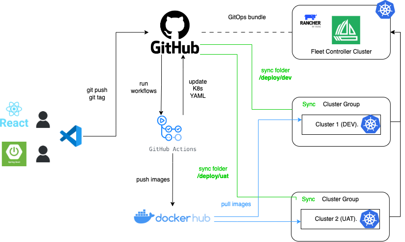
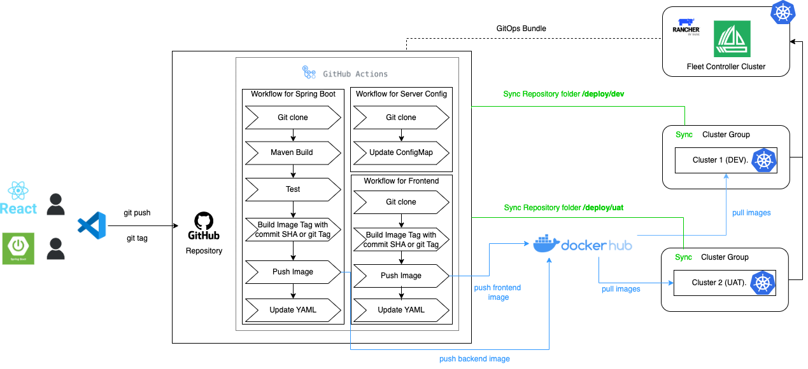

# Lab:  建立一個前後端分離專案之敏捷開發流水線

## GitOps流程圖

## GitHub Actions規劃

## 操作步驟

[1. Fork Github Repository ](docs/1.md)

[2. Github Repository配置](docs/2.md)

[3. Docker Hub 配置](docs/3.md)

[4. Local開發環境設置](docs/4.md)

[5. 首次進行部署與驗證](docs/5.md)

[6. 進行修改讓流水線自動部署吧 Part 1](docs/6.md)

[7. 進行修改讓流水線自動部署吧 Part 2](docs/7.md)

補充部分：

[Windows git clone操作步驟](docs/8.md)

[Windows git Push失敗處理方式](docs/9.md)

[Mac git clone操作步驟](docs/10.md)

[Mac git Push失敗處理方式](docs/11.md)