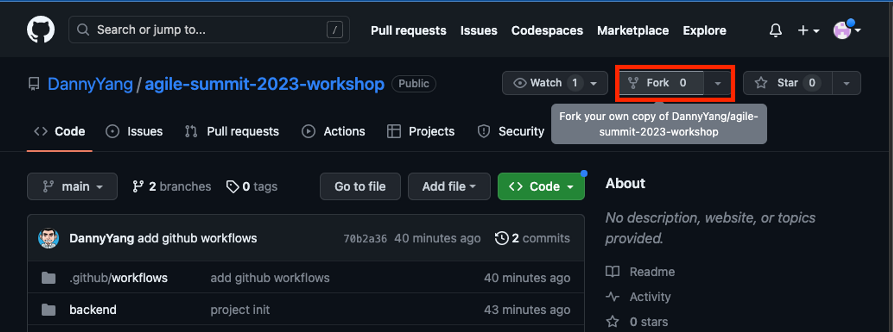

# 1. Fork Github Repository

(1) 首先，請先進Workshop repository，點擊「fork 」
(連結：[https://github.com/DannyYang/agile-summit-2023-workshop](https://github.com/DannyYang/agile-summit-2023-workshop))

(2) **＃重要＃**請確保這個勾勾關掉(因為我們要copy所有branch)，在按下Create fork

(3) 完成專案fork

(4) 啟動Github Action配置  (預設是關閉的)

(5) Github Action啟動完成

[2. Github Repository配置](2.md)