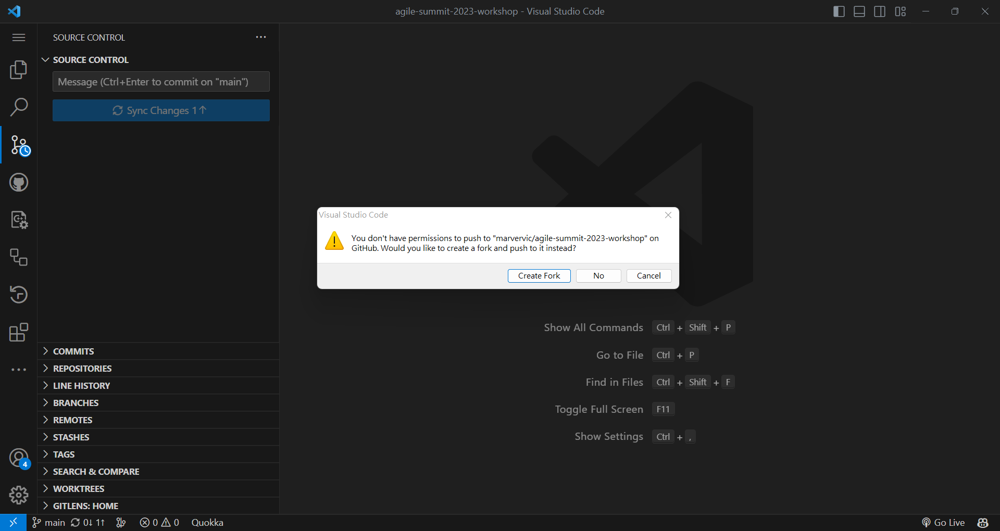

# Windows git Push失敗處理方式

## Push失敗 - 提示是否要fork專案

如果有多個github帳戶在使用，例如公司的github以及個人用的github你可能會遇到push程式失敗的問題。提示會提及是否要fork專案，此時代表需要更新儲存在Windows上的github憑證

在開始視窗輸入`control`打開控制台

點擊使用者帳戶

點擊管理Windows認證

找到並點擊`git:https://github.com`

移除此憑證 (不用緊張，等等git push時Windows就會跳出視窗要求你重新登入)

push程式

更新憑證成功

