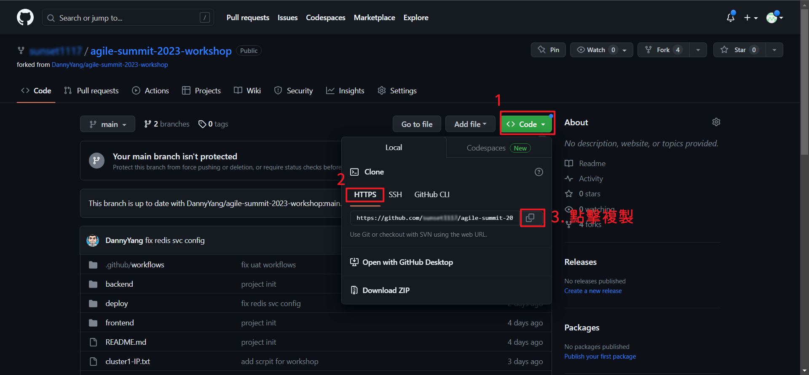

# Windows git clone操作步驟

(1) 複製剛剛Fork好的Repo網址

(2) 打開VS Code，使用快捷鍵`Ctrl + Shift + P`呼叫命令面板

(3) 輸入`gitcl`，選擇`Git: Clone`

(4) 貼上fork過來的repo URL後按下Enter

(5) 選擇local repo的目錄位置

(6) 點擊`Open`按鈕，VS Code會打開剛剛clone好的工作區

(7) 大功告成

