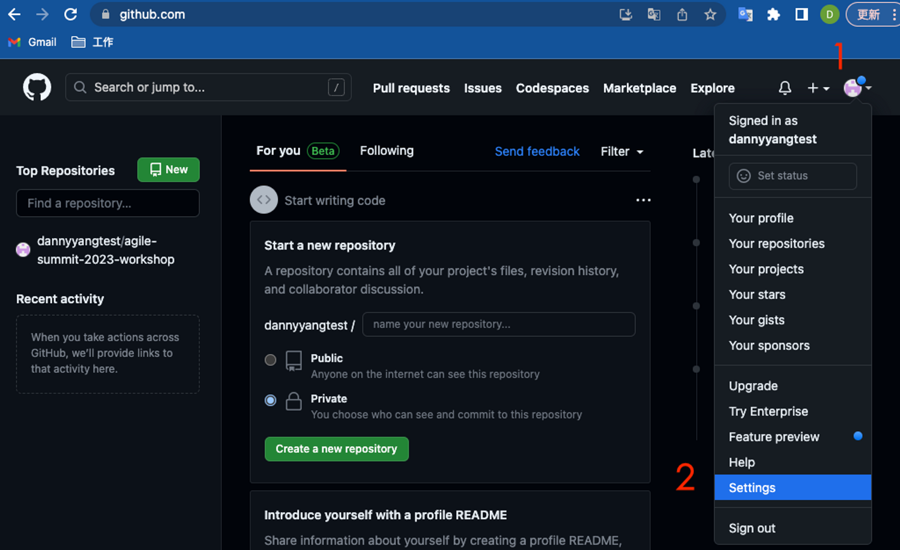

# 2. Github Repository配置

<aside>
💡 這部分是為了給Github Action 使用，需要配置Secret，共需要配置三個，分別是

| MY_GITHUB_TOKEN | 提供權限給 pipeline進行 push到remote的token |
| --- | --- |
| DOCKERHUB_USERNAME | 個人的Docker Hub 帳號  |
| DOCKERHUB_PASSWORD | 個人的Docker Hub 密碼 |
</aside>

### 2-1 設定MY_GITHUB_TOKEN

(1) 點擊右上角人物圖像，展開功能選單後，選擇Settings

(2)在左邊的Menu，往下找到Developer settings

(3)進入後，展開Personal access tokens，點擊Token(classic)後，展開Generate new token，點擊Generate new token (classic)

(4)輸入Github登入密碼

(5)輸入名稱mytoken(自訂)，請確保scope有包含框框內的項目(repo全選 & workflow)

(6)移動到最下面，點擊Generate token

(7)點擊複製icon (請好好保存，下次進來就再也看不到了，若遺失請重建)

### 2-2 設定Repository Secrets

(1)點選自己圖像，選擇Your repositories

(2)點擊剛剛fork的Project  agile-summit-2023-workshop

(3)點擊 Settings

(4)展開Secrets and variables，點擊Actions

(5)點擊New repository secrets ，來產生secrets

分別產生三個secrets，如下圖所示

| MY_GITHUB_TOKEN | 提供權限給 pipeline進行 push到remote的token |
| --- | --- |
| DOCKERHUB_USERNAME | 個人的Docker Hub 帳號 |
| DOCKERHUB_PASSWORD | 個人的Docker Hub 密碼 |

MY_GITHUB_TOKEN

DOCKERHUB_USERNAME

DOCKERHUB_PASSWORD

設定完成後，結果如下

本部分已完成

[3. Docker Hub 配置](3.md)