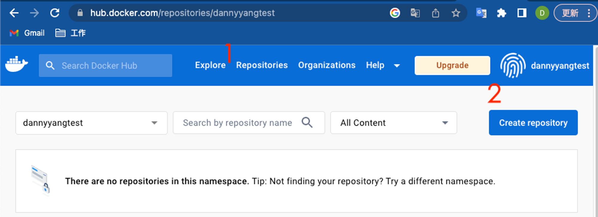

# 3. Docker Hub 配置

<aside>
💡 這裡我們先開好兩個Docker 上傳的repository給 Github Action CI上傳使用，在這裡，我們會建立兩個Repository

</aside>

登入Docker Hub後，點擊 Create repository

請建立兩個Repository

[vote-api]

[vote-ui]

Docker Hub 配置完成

[4. Local開發環境設置](4.md)