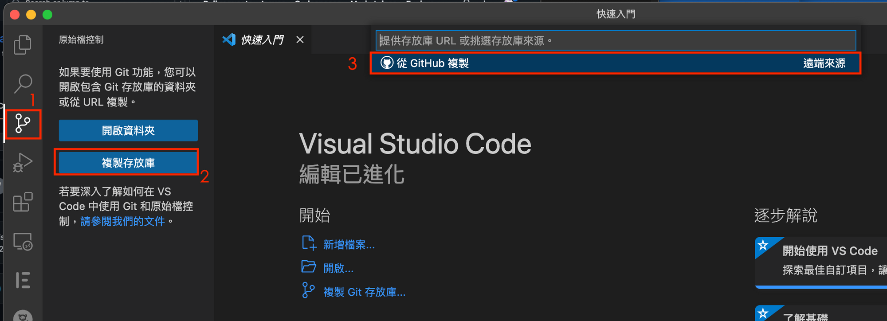

# 4. Local開發環境設置

(1)開啟VScode 

如果你是Windows步驟(1) ~ (



(2)點擊允許登入


(3) 點擊Authorize Visual-Studio-Code


(4)點擊開啟Visual Studio Code.app


(5)點擊開啟


(6)在上方視窗會顯示這個Github帳號底下所有的Repository，點選剛剛Fork的專案


(7)選擇Clone專案的存放位置(自訂可任意)，選好後點擊「選擇儲存庫位置」


(8)完成專案Clone與本地配置


(9)輸入cmd + J 喚起終端機(Mac). Windows ctrl + J


接下來的Workshop 大部分的git操作，都會在此進行，請先確保環境都Ready

(10)請將三個txt檔案修改成自己的環境資訊，並儲存

| dockerAccount.txt | 請填入個人的docker帳號 |
| --- | --- |
| cluster1-IP.txt | 請填入Cluster1的Node IP |
| cluster2-IP.txt | 請填入Cluster2的Node IP |

(11)dockerAccount.txt 部分，請輸入個人Docker 帳號 (請確認單行，沒有多餘空格)，再請存檔


(12)Cluster1 IP 請連上現場提供之Rancher雲端環境


(13)展開後點擊cluster1


(14)點擊Cluster底下的Nodes


(15)可以看到這個Node的對外IP，請複製下來，可以按旁邊的複製icon


(16)將Cluster1 IP 貼到，cluster1-IP.txt上，並儲存


(17)接下來將設置cluster2-IP.txt ，請先回到Rancher管理平台上，點擊左上方漢堡圖示


(18)點擊cluster2，切換至cluster管理平台上


(19)同樣點擊Nodes，取得對外IP資訊，並複製


(20)回到VScode修改cluster2-IP.txt，並儲存


設定完成後，請開啟VSCode終端機(Mac: cmd+J, Windows: ctrl+J) 執行腳本修改個人專案
Mac執行 ./setup.sh

Windows 則執行 ./setup.ps1

執行後，結果如下圖，共修改8個檔案


<aside>
💡 若執行時出現權限不足時(permission denied)，請先執行
chmod +x setup.sh
開啟權限後，在執行一次./setup.sh

</aside>

(21)配置完成後，先git commit & push到Github，依序執行

```bash
git add .
git commit -m 'project config complete'
git push
```

如下圖所示


完成專案初始化配置

[5. 首次進行部署與驗證](5.md)