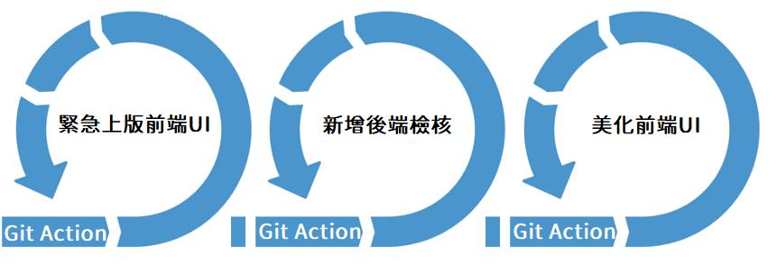

# 5. 首次進行部署與驗證

<aside>
💡 接下來將會正式部署到雲端叢集兩個環境上，過程中會有三次迭代，分別是(1)更改設定 (2)更改後端程式碼，(3)更改前端程式碼，過程中會觸發不同GIthub Action pipeline

</aside>

(1)回到Rancher管理畫面，點擊左上方漢堡選項

(2)點擊Continuous Delivery

(3)在Git Repos 功能選項中，點擊Add Repository

(4)除了Repository URL填寫個人的之外，其他部分請調整

| 欄位 | 填入 | 說明 |
| --- | --- | --- |
| Name | dev | dev環境 辨別的名稱 |
| Repository URL | 個人Repo URL | gitops 的repository |
| Branch Name | main | gitops 偵測的branch |
| Paths | /deploy/dev | gitops 偵測的部署目錄, 裡面為K8s部署物件 |

(5)編輯完成後，右下角Next

在Target的下拉選單中，請選擇「cluster1」 

(6)按下Create後，完成cluster 1的GitOps部署配置

(7)驗證部署結果，點選左上方漢堡選單，點擊cluster1

(8)在Service Discovery底下，點擊Ingresses，後選擇 Name 為ui-ingress 旁邊的url連結

(9)點擊後，將會開啟分頁，看到以下畫面代表，dev環境配置完成

(10)接著回到剛剛配置Git的Continuous Delivery

(11)在Git Repos中，在新增另一個Repository，點擊Add Repository

(12)填入以下資訊

| 欄位 | 填入 | 說明 |
| --- | --- | --- |
| Name | uat | uat環境 辨別的名稱 |
| Repository URL | 個人Repo URL | gitops 的repository |
| Branch Name | main | gitops 偵測的branch, github 預設main branch |
| Paths | /deploy/dev | gitops 偵測的部署目錄, 裡面為K8s部署物件 |

輸入完成後，點擊右下角Next

(13)請選擇部署的Cluster，請選擇cluster2，選擇後，點擊右下角Create

(14)等待uat部署完成

(15)驗證部署結果，點選左上方漢堡選單，點擊cluster2

在Service Discorvery底下，點擊Ingresses

點擊後，將會開啟分頁，看到以下畫面代表uat環境配置完成

[6. 進行修改讓流水線自動部署吧 Part 1](6.md)