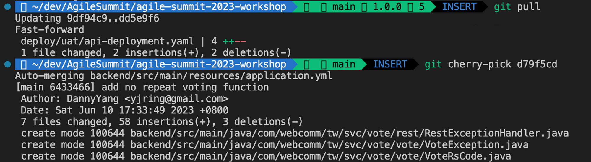

# 7. 進行修改讓流水線自動部署吧 Part 2

<aside>
💡 接下將更近一步，透過實作體驗來介紹一些實務DevOps上的狀況

</aside>

在開始之前，請隨時記得先git pull 拉一下最新的檔案，以減少衝突merge事宜

(1) PO說，一個堂堂投票系統，竟然可以重複投票，太荒誕了，請立刻修改

於是團隊修改後，並且push到另一個branch feature上，你準備將後端程式碼併入到main branch

輸入以下git 指令來更新最新的後端程式碼

```bash
git pull
git cherry-pick d79f5cd
```



你可以看到Backend有些新增檔案，以及修改的地方，接下來，進行git push 來觸發DEV的部署，來看看結果是否為PO要的

```bash
git push
```


(2) 觀察Github Action是否有成功跑起來


觀察：你可以觀察到，這兩個pipeline觸發條件，是有特定路近的偵測，一個是backend的程式碼，另一個是設定檔案


(3) 驗證dev環境結果

你會發現投票後就無法切換了，成功部署上去了！


(4) PO 認為畫面太簡陋，體驗也不佳，請團隊進行修正，於是請前端團隊，進行體驗優化，一段時間後，妳得知他們的Code已經Ready了，於是你輸入以下git取的最新程式碼

```bash
git pull
git cherry-pick c05c9bd
```

檢查一下差異後，你覺得OK沒問題，直接上版

```bash
git push
```

等待UI部分打包完成


(觀察到，這次只有UI pipeline正在執行)

(5) 刷新DEV環境的網頁驗證看看吧


(6) 覺得滿意後，就push tag 到 Github上 讓pipeline發佈到Cluster2吧

```bash
git pull
git tag 2.0.0
git push origin 2.0.0
```