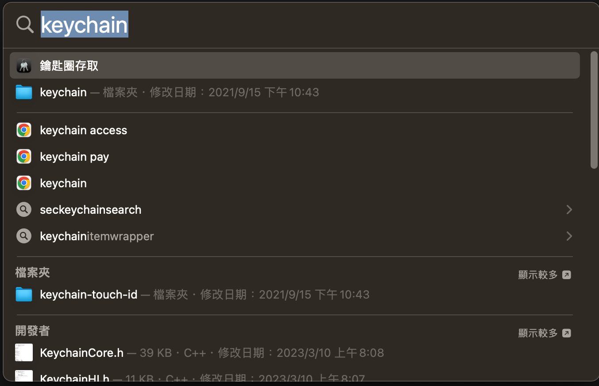
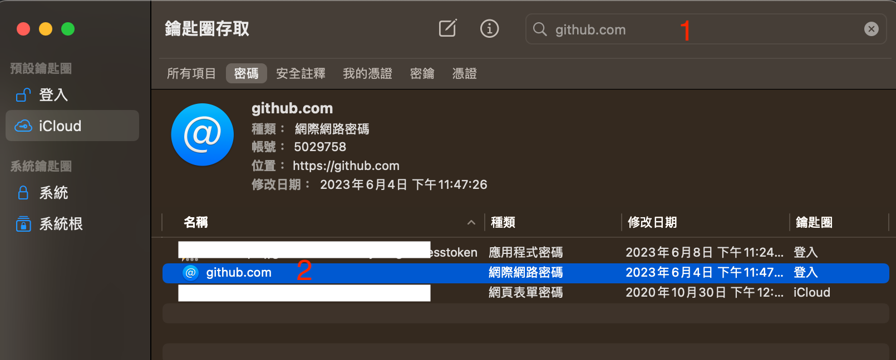

# Mac git Push失敗處理方式

如果有多個github帳戶在使用，例如公司的github以及個人用的github你可能會遇到push程式失敗的問題。提示會提及是否要fork專案，此時代表需要更新儲存在Windows上的github憑證

(1) 使用spotlight 搜尋：keychain，打開鑰匙圈存取

(2)搜尋欄位輸入github.com

(3)點擊刪除github.com

(4)下次在git push時，如果會請你輸入帳號&密碼，密碼部分直接輸入Github token就可以了